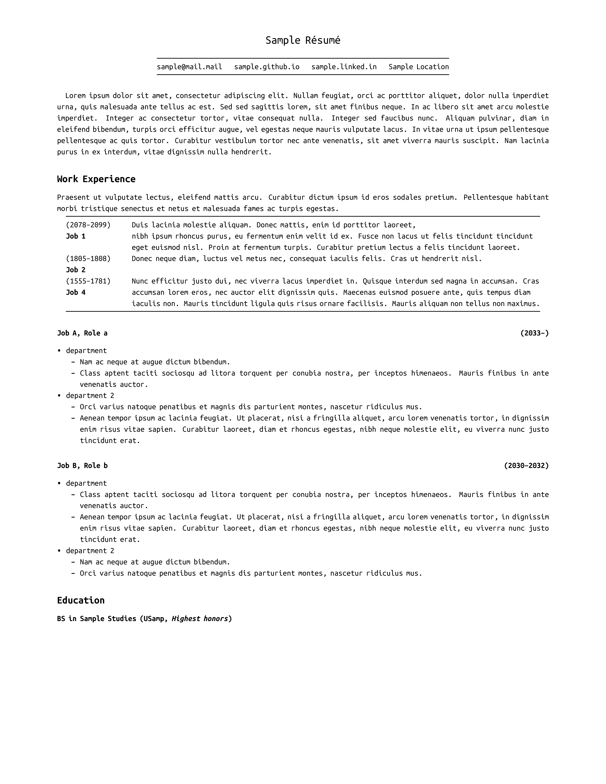

# Pandoc-Résumé

Write a résumé in markdown and convert to PDF, DOCX, and HTML.
Pandoc converts `template.md` into several standalone formats with similar styles.

## Usage

Edit `template.md` to add content. Edit `style.css` to change the HTML style and `reference.docx` for the DOCX style.

Run one of these commands to convert `template.md`:

```
build.sh template pdf
build.sh template docx
build.sh template html
```

To generate all formats, run

```
all.sh template
```

### DOCX, HTML

These output formats may need further processing.

## Sample


